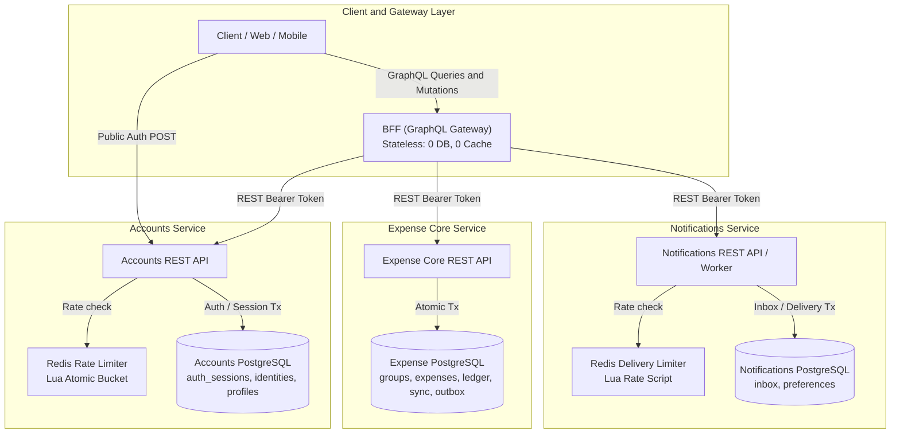
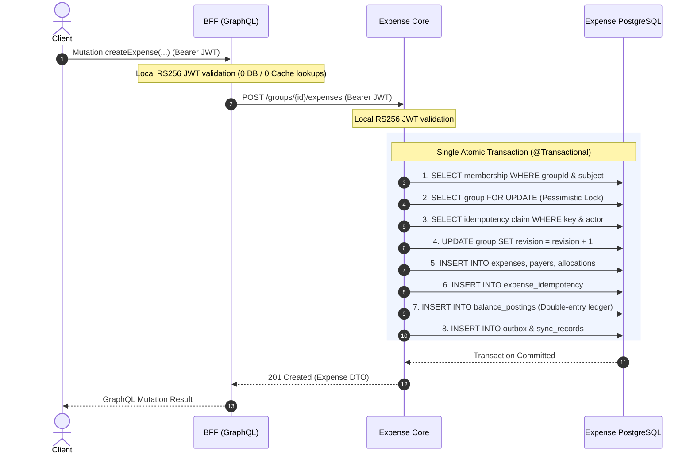
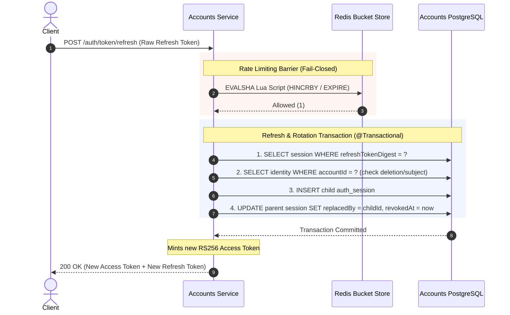

# Database and Cache Access Patterns

This document details the database (PostgreSQL) and cache (Redis) access patterns across all request types in the Pennywise / Squarewise architecture.

## Architectural Principles

1. **PostgreSQL as Authoritative Source of Truth**:
   - Each stateful service (`accounts`, `expense-core`, `notifications`) owns an isolated PostgreSQL database.
   - Cross-service SQL joins, shared database entities, and distributed transactions are strictly prohibited.
2. **Redis as Rate-Limit Bucket Accelerator**:
   - Redis is not used as an authoritative entity or session store.
   - It acts as an operational rate-limit barrier evaluated via atomic Lua scripts for passwordless authentication and notification delivery.
   - Failures in Redis fail closed to protect downstream resources.
3. **Stateless JWT Validation (Zero DB / Zero Cache Bearer Reads)**:
   - Bearer JWT tokens are validated in-process using RS256 and cached/in-memory JWK public keys.
   - Neither Accounts PostgreSQL nor Redis is queried solely to validate an active bearer access token.
4. **BFF is Completely Database-Free**:
   - The BFF microservice has zero database or cache connections, acting strictly as a GraphQL-to-REST facade.

---

## Topology and Layering

---

## Per-Request Database & Cache Lookup Matrix

| Category | Endpoint / Request Operation | Cache Lookups (Redis) | DB Queries (PostgreSQL) | Persistence Operations & Details |
|---|---|:---:|:---:|---|
| **Public Auth** | `POST /auth/login/start` | **1 write/eval** *(Rate limit)* | **0** | Atomically checks/updates rate limit slot (`squarewise:rl:v1:<HMAC>`). Sends code/link via provider/outbox. |
| | `POST /auth/login/verify` | **0** | **3 - 5** *(1 Tx)* | Single-use credential verify/redeem, `account_identities` lookup/enrollment, profile creation (if new), `auth_sessions` insert, audit log. |
| | `POST /auth/token/refresh` | **1 write/eval** *(Rate limit)* | **3 - 4** *(1 Tx)* | Rate limit check, lookup session by token digest, identity status check, save child session, rotate parent session. |
| | `POST /auth/logout` | **0** | **1 - 2** *(1 Tx)* | Marks token family/session revoked in `auth_sessions`. |
| **Accounts** | `GET /me` | **0** | **1 read** | `profiles` lookup by caller's subject. |
| | `PATCH /me` | **0** | **2** *(1 Tx)* | Load profile + update profile fields. |
| | `GET /profiles/{accountId}` | **0** | **1 - 2 reads** | Caller profile verification (if non-workload) + target profile lookup. |
| | `POST /profiles/batch` | **0** | **1 - 2 reads** | Self-verification (if non-workload) + `IN (:accountIds)` query (up to 100). |
| | `POST /me/deletion-request` | **0** | **2 - 3** *(1 Tx)* | Records deletion request + bulk revokes all active `auth_sessions`. |
| | `POST /me/export-request` | **0** | **1 write** | Inserts request into export table. |
| **Expense Core** *(Commands)* | `POST /groups` | **0** | **2 - 3** *(1 Tx)* | Inserts group, adds initial creator membership, emits outbox event. |
| | `POST /groups/{id}/expenses` *(Create)* | **0** | **6 - 8** *(1 Tx)* | 1. Active membership check 2. Group pessimistic lock (`findForMembershipUpdate`) 3. Idempotency claim lookup 4. Group revision update 5. Save expense + payers + allocations 6. Save idempotency record 7. Double-entry ledger postings (`balance_postings`) 8. Outbox message + sync feed record |
| | `PUT /groups/{id}/expenses/{id}` *(Update)* | **0** | **5 - 7** *(1 Tx)* | Active check, group lock, load current expense, save updated expense, post reversal & new balance entries, outbox + sync records. |
| | `DELETE /groups/{id}/expenses/{id}` | **0** | **4 - 5** *(1 Tx)* | Active check, group lock, soft delete/version update, balance reversal posting, outbox + sync records. |
| | `POST /groups/{id}/settlements` | **0** | **5 - 6** *(1 Tx)* | Active check, group lock, insert settlement, post ledger credit/debit, outbox + sync records. |
| | `POST /invites/{token}/claim` | **0** | **3 - 4** *(1 Tx)* | Check invite validity, mark claimed, insert group membership, emit member-added outbox event. |
| **Expense Core** *(Queries)* | `GET /groups` | **0** | **1 read** | Join on `group_memberships` for caller subject. |
| | `GET /groups/{id}` | **0** | **2 reads** | Verify caller membership + fetch group details. |
| | `GET /groups/{id}/expenses` | **0** | **2 reads** | Verify membership + keyset/offset page query from `expenses`. |
| | `GET /groups/{id}/balances` | **0** | **2 reads** | Verify membership + aggregate ledger balance query (`balance_postings` sum). |
| | `GET /groups/{id}/search` | **0** | **2 reads** | Verify membership + indexed filtered query on expenses. |
| | `GET /groups/{id}/sync/changes` | **0** | **2 reads** | Verify membership + fetch sync change feed by revision cursor. |
| **Notifications** | `GET /inbox` | **0** | **1 read** | Cursor-paginated read from `notifications_inbox` by recipient subject. |
| | `POST /inbox/{id}/read` | **0** | **1 write** | Update notification read status timestamp. |
| | Background Delivery Worker | **1 write/eval** *(Rate limit)* | **2 - 3** *(1 Tx)* | Check subject rate limit in Redis (`squarewise:notification-rate:v1:*`), fetch inbox item, mark delivery attempt/status. |
| **BFF (GraphQL)** | All Queries & Mutations | **0** | **0** | BFF has **no database or cache dependencies**; it proxies REST requests to downstream services. |

---

## Detailed Request Flow Diagrams

### 1. Financial Command Flow (`createExpense`)

Expense Core performs all aggregate mutations, double-entry ledger postings, revision tracking, outbox emissions, and sync log changes within a single atomic local transaction.

### 2. Token Refresh Flow (`refreshToken`)

The refresh flow utilizes Redis as an atomic fail-closed rate limit barrier before performing writer-authoritative rotation in PostgreSQL.

