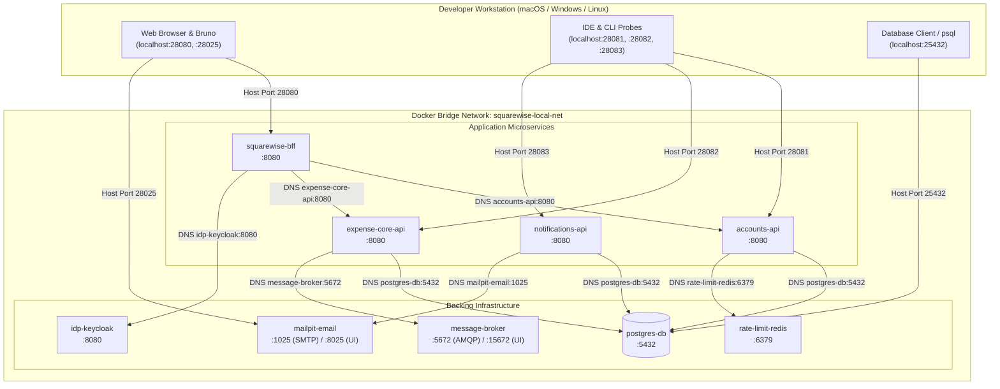

# Local Compose topology

All local entry points derive services from `infra/local/docker-compose.yml` or
`infra/local/docker-compose.dev.yml`. Local credentials are intentionally fixed
and must never be reused outside a developer machine. Run one topology at a
time because each publishes the same stable host ports.

## Local resource budget

Every local Compose service has explicit CPU and memory reservations and hard
limits. CPU reservations are the minimum scheduler share requested when
resources are constrained; CPU limits are the maximum number of host CPU cores
the container may consume. They are quotas, not a promise of dedicated host
cores.
The dependency-only file is the shared baseline inherited by standalone
topologies; application containers add their limits in the full-stack file.
These workstation-sized values are not production sizing:

| Service | CPU reservation / limit | Memory reservation / limit |
| --- | ---: | ---: |
| PostgreSQL | 0.25 / 1.00 cores | 256 MiB / 768 MiB |
| RabbitMQ | 0.25 / 1.00 cores | 256 MiB / 768 MiB |
| Mailpit | 0.05 / 0.25 cores | 64 MiB / 256 MiB |
| Accounts | 0.25 / 1.00 cores | 192 MiB / 512 MiB |
| Expense Core | 0.50 / 1.50 cores | 256 MiB / 768 MiB |
| Notifications | 0.25 / 1.00 cores | 192 MiB / 512 MiB |
| BFF | 0.25 / 1.00 cores | 192 MiB / 512 MiB |

The complete stack reserves 1.8 CPU cores and about 1.4 GiB; it is capped at
7.75 CPU cores and about 4.0 GiB, before Docker overhead. Compose applies these values through
`deploy.resources`; verify the effective configuration with
`make compose-config`. If a workstation has less available memory, start a
narrow topology or increase Docker Desktop resources rather than removing limits.

## Command and service matrix

| Purpose | Compose file | Services | Start | Inspect | Stop |
| --- | --- | --- | --- | --- | --- |
| Shared dependencies | `infra/local/docker-compose.yml` | PostgreSQL, RabbitMQ, Mailpit | `make deps-up` | `make deps-status`, `make deps-logs` | `make deps-down` |
| Native Accounts | `infra/local/docker-compose.accounts.yml` | PostgreSQL | `make accounts-deps-up` | `make accounts-deps-status`, `make accounts-deps-logs` | `make accounts-deps-down` |
| Native Expense Core | `infra/local/docker-compose.expense-core.yml` | PostgreSQL, RabbitMQ | `make expense-core-deps-up` | `make expense-core-deps-status`, `make expense-core-deps-logs` | `make expense-core-deps-down` |
| Native Notifications | `infra/local/docker-compose.notifications.yml` | PostgreSQL, RabbitMQ, Mailpit | `make notifications-deps-up` | `make notifications-deps-status`, `make notifications-deps-logs` | `make notifications-deps-down` |
| Native BFF | `infra/local/docker-compose.bff.yml` | Accounts and Expense Core upstreams, PostgreSQL, RabbitMQ | `make bff-deps-up` | `make bff-deps-status`, `make bff-deps-logs` | `make bff-deps-down` |
| Complete stack | `infra/local/docker-compose.dev.yml` | All four applications plus PostgreSQL, RabbitMQ, Mailpit, and Keycloak (`idp-keycloak`) | `make full-up` | `make full-status`, `make full-logs` | `make full-down` |

Every row also has a `-config` target. `make compose-config` validates all six
files without starting containers. `make help` lists these commands and the
exact Compose file each command uses.

For rate-limit diagnostics, use `make redis-status` and `make redis-logs`. To
reset disposable local limiter state, use `make redis-clear-rate-limit`; it
deletes only keys matching `squarewise:rl:v1:*` and never removes PostgreSQL
volumes or unrelated Redis keys.

The BFF is database-free. Its standalone topology therefore starts its real
Accounts and Expense Core HTTP upstreams rather than PostgreSQL for the BFF
itself. Those upstreams require PostgreSQL, and Expense Core also requires
RabbitMQ. Notifications is not an implemented BFF gateway dependency and is not
included in this narrow topology.

## Ports and local credentials

Local development uses a dedicated user-defined Docker bridge network (`squarewise-local-net`).
Inside the bridge network, containers communicate via descriptive Docker hostnames on standard
internal ports (`5432`, `5672`, `6379`, `1025`, `8080`). External access from developer host tools
(browsers, IDEs, Bruno, DataGrip, `psql`) maps to deterministic, collision-free `28xxx` ports.



### Deterministic port mapping matrix

| Component | Container port | Host port | Local access |
| --- | ---: | ---: | --- |
| PostgreSQL | 5432 | 25432 | user `squarewise`, password `squarewise-local-only` |
| RabbitMQ AMQP | 5672 | 28672 | user `squarewise`, password `squarewise-local-only` |
| RabbitMQ management | 15672 | 28673 | `http://localhost:28673` with the RabbitMQ local credentials |
| Redis | 6379 | 28379 | password `squarewise-redis-local-only` |
| Mailpit SMTP | 1025 | 21025 | no authentication |
| Mailpit web UI | 8025 | 28025 | `http://localhost:28025` |
| Keycloak OIDC | 8080 | 28090 | `http://localhost:28090` (`idp-keycloak` inside Compose) |
| BFF | 8080 | 28080 | `http://localhost:28080` |
| Accounts | 8080 | 28081 | `http://localhost:28081` |
| Expense Core | 8080 | 28082 | `http://localhost:28082` |
| Notifications | 8080 | 28083 | `http://localhost:28083` |

On first creation PostgreSQL runs `init-databases.sql`, which creates
`squarewise_accounts`, `squarewise_expense_core`, and
`squarewise_notifications`. Removing containers with `down` does not request
volume deletion; use explicit Docker volume administration only when a clean
database is intended.

## Native application environment

The checked-in IntelliJ configurations already provide these values. Equivalent
shell launches must set them before the corresponding Gradle `bootRun` task.

| Application | Port | Required local environment |
| --- | ---: | --- |
| Accounts | 28081 | `SPRING_DATASOURCE_URL=jdbc:postgresql://localhost:25432/squarewise_accounts`, datasource user/password above, Redis port `28379` |
| Expense Core | 28082 | `SPRING_DATASOURCE_URL=jdbc:postgresql://localhost:25432/squarewise_expense_core`, datasource credentials, RabbitMQ host `localhost`, port `28672`, and credentials |
| Notifications | 28083 | `SPRING_DATASOURCE_URL=jdbc:postgresql://localhost:25432/squarewise_notifications`, datasource and RabbitMQ values, email host `localhost`, email port `21025`, Redis port `28379` |
| BFF | 28080 | Accounts URL `http://localhost:28081`, Expense Core URL `http://localhost:28082`, Notifications URL `http://localhost:28083`, RabbitMQ port `28672` |

Set `SPRING_PROFILES_ACTIVE=local-oidc`, configure the local Keycloak issuer and
audience, and set `SERVER_PORT` to the table's port. The
exact variable names are version-controlled in `.run/`.

## Cross-platform networking architecture (macOS, Windows, Linux)

To ensure multi-developer collaboration without configuration divergence, Squarewise avoids host-only networking (`network_mode: host`) and standard colliding ports (5432, 8080, 6379).

### Cross-platform behavior comparison

| Host OS | Engine runtime | `network_mode: host` behavior | User-defined bridge + deterministic ports (Squarewise) |
|---|---|---|---|
| **macOS** | Hypervisor VM (Virtualization.framework) | ❌ Incompatible: containers bind to the Linux VM loopback, unreachable from host browser/IDE. | ✅ Fully supported: Docker forwards deterministic `28xxx` ports to macOS `localhost`. |
| **Windows** | WSL2 lightweight VM | ❌ Incompatible: containers attach to WSL2 VM virtual network adapter, breaking host-port discovery. | ✅ Fully supported: WSL2 port forwarding bridges to Windows `localhost`. |
| **Linux** | Native kernel namespaces | ⚠️ High collision risk: binds directly to host interfaces, colliding with any host DBs or services. | ✅ Fully supported: strict port isolation + deterministic port mapping. |

### Host-to-container and container-to-host resolution
1. **Container to Container**: All services communicate via Docker internal DNS using descriptive hostnames (`postgres-db:5432`, `message-broker:5672`, `idp-keycloak:8080`, `accounts-api:8080`).
2. **Host to Container**: Developer tools (IntelliJ, VS Code, Bruno, browser, `psql`) connect via deterministic published ports (`localhost:28080`, `localhost:28081`, `localhost:25432`).
3. **Container to Host**: Where containers need to access host-bound services, `extra_hosts: ["host.docker.internal:host-gateway"]` provides seamless cross-platform parity on Linux alongside macOS and Windows.

## Health and startup order

PostgreSQL is healthy only after `pg_isready` confirms the application
`squarewise_accounts` database is accepting connections; this prevents dependent
services from racing the local init script that creates the service databases.
RabbitMQ uses `rabbitmq-diagnostics -q ping`; Mailpit checks its HTTP UI. Compose waits for
these checks before starting dependent applications. In the full topology,
Accounts waits for PostgreSQL, Expense Core waits for PostgreSQL and RabbitMQ,
Notifications waits for PostgreSQL, RabbitMQ, and Mailpit, and BFF starts after
the three REST services have started.

The dependency targets use `up -d --wait`, so a successful command means the
selected dependency health checks passed. The full stack remains attached in
the foreground so application startup failures are immediately visible; use a
second terminal for `make full-status` or `make acceptance-live`.

## Images and validation

The full local topology assigns stable meaningful internal hostnames:
`postgres-db`, `message-broker`, `mailpit-email`, `accounts-api`,
`expense-core-api`, `notifications-api`, and `squarewise-bff`. Container-to-
container URLs should use these names; `localhost` is reserved for host-native
development. The dependency services declare these names as explicit network
aliases, because a Compose `hostname` alone does not guarantee service-DNS
resolution. The local Keycloak OIDC provider uses `idp-keycloak`; its issuer
and audience are injected through the `local-oidc` profile under AUTH-06.
Accounts' local-oidc resource server additionally enables the explicit
`SQUAREWISE_SECURITY_OIDC_EXTERNAL_VALIDATION_ENABLED` compatibility switch.
This lets CI Keycloak personas and Accounts-owned passwordless RS256 tokens be
validated during local testing; production and staging keep the Accounts-owned
JWKS decoder without this fallback.

The full and BFF prerequisite topologies use
`infra/docker/Dockerfile.dev` and Gradle `bootRun`. For fast runtime images from
already packaged jars, use `make docker-fast-all`; for production-style
multi-stage images, use `make docker-build-all`. Those image-build commands do
not start a Compose topology.

Validate configuration and public contracts before committing topology changes:

```sh
make compose-config
python3 tools/contracts/validate.py
python3 tools/contracts/validate_public_surface.py
git diff --check
```
