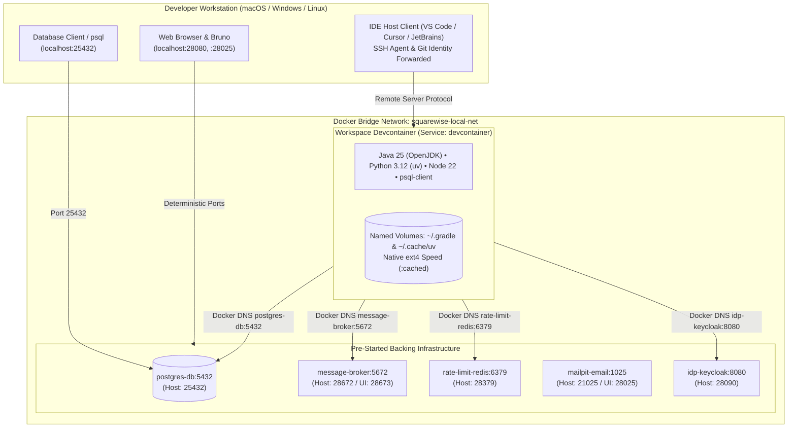

# Devcontainer Developer Guide

Squarewise provides a pre-configured OCI Devcontainer workspace designed for **zero-friction clone-and-run onboarding**.

A new developer can clone the repository, open it in their IDE of choice (VS Code, Cursor, or JetBrains Gateway), and immediately start developing, running tests, or querying live GraphQL and REST APIs with rich seeded test data.



---

## 1. Quickstart: Opening the Devcontainer

### Prerequisites
- [Docker Desktop](https://www.docker.com/products/docker-desktop/), [Rancher Desktop](https://rancherdesktop.io/), or [OrbStack](https://orbstack.dev/) running locally.
- Recommended memory allocation: 4–6 GiB RAM.

### Visual Studio Code & Cursor (1-Click)
1. Clone the repository:
   ```sh
   git clone https://github.com/ohbus/squarewise.git
   cd squarewise
   ```
2. Open in VS Code or Cursor:
   ```sh
   code .   # or cursor .
   ```
3. When prompted with **"Folder contains a Dev Container configuration file. Reopen to develop in a container"**, click **Reopen in Container**.
   - Alternatively, open the Command Palette (`Cmd+Shift+P` / `Ctrl+Shift+P`) and select **Dev Containers: Reopen in Container**.
4. The Devcontainer automatically:
   - Builds the workspace image (Java 25, Python 3.12, `uv`, Node 22, `psql`).
   - Starts all backing services (`postgres-db`, `message-broker`, `rate-limit-redis`, `mailpit-email`, `idp-keycloak`).
   - Runs `updateContentCommand` to warm the `uv` virtual environment and Gradle wrapper.
   - Executes `.devcontainer/post-start.sh` to await service health and seed development personas and sample groups.
   - Prints a welcome dashboard in the integrated terminal with pre-minted Bearer tokens and URLs.

### JetBrains Gateway & IntelliJ IDEA
1. Launch **JetBrains Gateway** (or IntelliJ IDEA Remote Development).
2. Choose **Dev Containers**.
3. Point to the repository folder and select `.devcontainer/devcontainer.json`.
4. Click **Create and Start Dev Container**.
5. IntelliJ connects as an unprivileged client inside the container, with the Java 25 SDK pre-configured at `/usr/lib/jvm/default-java`.

---

## 2. Deterministic Local Endpoints

All external ports are mapped to the collision-free `28xxx` family:

| Service | Internal Docker Endpoint | Host / Forwarded Endpoint | Description |
|---|---|---|---|
| **GraphQL BFF Gateway** | `http://squarewise-bff:8080` | `http://localhost:28080/graphql` | Unified GraphQL API & WebSocket subscriptions |
| **Accounts REST API** | `http://accounts-api:8080` | `http://localhost:28081/accounts/v1/` | Profile management & identity linkage |
| **Expense Core REST API** | `http://expense-core-api:8080` | `http://localhost:28082/expense-core/v1/` | Financial ledger, groups, & expenses |
| **Notifications REST API** | `http://notifications-api:8080` | `http://localhost:28083/notifications/v1/` | In-app inbox & notification preferences |
| **Mailpit Web UI** | `http://mailpit-email:8025` | `http://localhost:28025/` | In-browser email inbox for verification emails |
| **Keycloak OIDC Provider** | `http://idp-keycloak:8080` | `http://localhost:28090/` | Local OpenID Connect Identity Provider |
| **RabbitMQ Management** | `http://message-broker:15672`| `http://localhost:28673/` | Queue monitoring (`squarewise` / `squarewise-local-only`) |
| **PostgreSQL 17 Database**| `postgres-db:5432` | `localhost:25432` | Direct SQL access (`squarewise` / `squarewise-local-only`) |

---

## 3. Preloaded Development Data

On container startup, `tools/ops/seed_dev_data.py` executes automatically if the database is unseeded, populating:

- **Personas**:
  - **Alice** (`alice@squarewise.local`): Group administrator (Keycloak client: `squarewise-ci`)
  - **Bob** (`bob@squarewise.local`): Active member (Keycloak client: `squarewise-ci-e2e-bob`)
  - **Charlie** (`charlie@squarewise.local`): Non-member / invitee (Keycloak client: `squarewise-ci-e2e-nonmember`)
  - **Dave** (`dave@squarewise.local`) & **Eve** (`eve@squarewise.local`)
- **Realistic Groups**:
  - *Apartment 4B* (EUR): Recurring utilities & rent
  - *Dolomites Ski Trip* (EUR): Multi-user travel expenses
  - *California Roadtrip* (USD): Multi-currency expense allocations
  - *Weekend Gaming* (GBP): Minor exact splits and settlements
- **Outbox & Sync Logs**: Transactional outbox records and sync changelog ready for GraphQL subscription replay.

To re-seed or reset data at any time, run:
```sh
make seed
```

---

## 4. Development Workflow Inside the Devcontainer

Inside the integrated terminal, run standard commands without configuring local toolchains:

```sh
# Run fast JVM unit tests
make test-unit

# Validate contracts, OpenAPI specs, GraphQL schemas, and linters
make check

# Run python typechecker (strict mypy)
make python-typecheck

# Validate all Docker Compose topologies
make compose-config

# Start all four microservice JARs in Docker for full-stack integration testing
make compose-dev-up
```

---

## 5. Performance & Caching Architecture

1. **Native Linux Filesystem Speed**:
   Gradle caches (`/home/vscode/.gradle`) and uv package caches (`/home/vscode/.cache/uv`) are mounted to dedicated named Docker volumes (`gradle-cache`, `uv-cache`). On Windows (WSL2) and macOS, this prevents file I/O translation overhead across the host mount.
2. **Optimized Gradle Daemon**:
   The workspace image configures `-Xmx1536m -XX:+UseZGC`, VFS watching (`org.gradle.vfs.watch=true`), and parallel execution (`org.gradle.parallel=true`) in `/home/vscode/.gradle/gradle.properties`.
3. **No Docker-outside-of-Docker**:
   The workspace container does not mount `/var/run/docker.sock`, maintaining strict security boundaries and preventing host daemon pollution.
