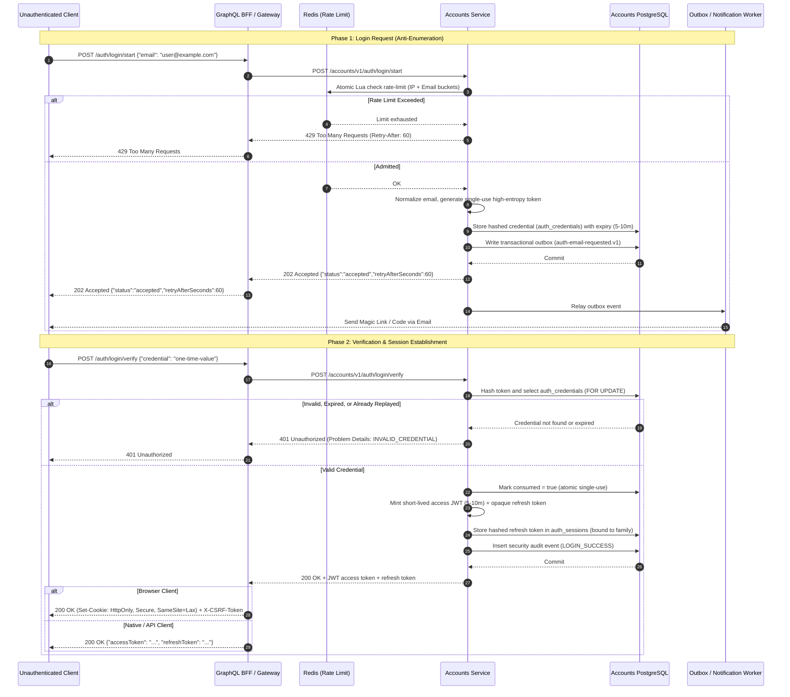
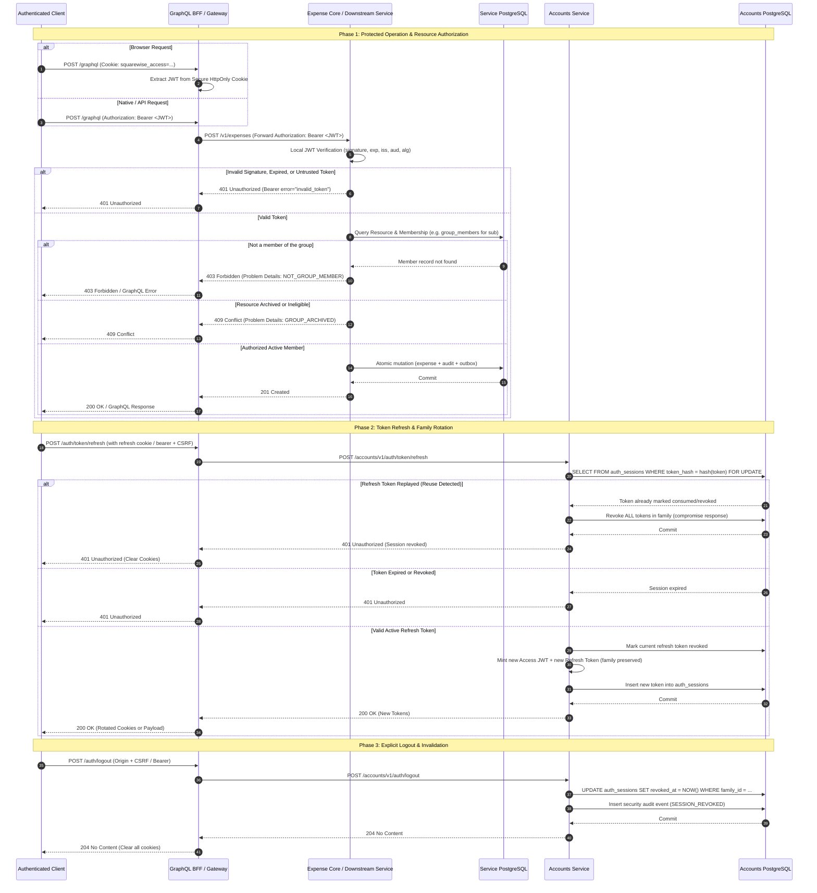

# Authentication and authorization lifecycle architecture

## Purpose

This document provides a comprehensive, authoritative specification of the authentication and
authorization lifecycle for both unauthenticated and authenticated actors across Squarewise /
Squarewise. It details the complete state transitions, authorization matrix, sequence flows,
event emissions, and security guarantees across REST, GraphQL, WebSocket, and asynchronous worker
boundaries.

---

## 1. Actor Classification & Trust Boundary

Squarewise distinguishes four classes of callers:

1. **Anonymous / Unauthenticated Actors:** External callers without identity credentials. Access is
   restricted to explicitly allow-listed public ingress paths (`POST /accounts/v1/auth/login/start`,
   `POST /accounts/v1/auth/login/verify`, and liveness probes).
2. **Authenticated Users (Browser SPA/SSR):** Interactive users whose sessions are maintained via
   `Secure`, `HttpOnly`, `SameSite=Lax` cookies with strict double-submit CSRF tokens on mutations.
3. **Authenticated Users (Native App / External API):** Programmatic clients supplying an
   `Authorization: Bearer <JWT>` header with short-lived tokens and rotating refresh tokens.
4. **Internal Workload Identities:** Service-to-service internal calls carrying verified workload
   assertions (e.g. `X-Squarewise-Workload-Role`) over mTLS/private mesh.

---

## 2. Authentication & Authorization Lifecycle Matrix

The matrix below maps actor states to operations, required security policies, audit events, and
exact negative/error outcomes.

| Actor State | Operation / Endpoint | Authentication Check | Authorization / Policy | Security Audit Event Emitted | Failure Response & Status |
|---|---|---|---|---|---|
| **Unauthenticated** | `POST /auth/login/start` | Public boundary | Redis sliding-window rate limit (per IP & email); email canonicalization; anti-enumeration | `AUTH_LOGIN_REQUESTED` (on admission) | `429 Too Many Requests` (`RATE_LIMITED`, `Retry-After: 60`) or `400 Bad Request` |
| **Unauthenticated** | `POST /auth/login/verify` | Public boundary | Single-use credential validation against salted SHA-256 hash; attempt counter `< 5`; expiry `< 10m` | `AUTH_LOGIN_FAILED` (on invalid) or `AUTH_LOGIN_SUCCESS` (on success) | `401 Unauthorized` (`INVALID_CREDENTIAL`) or `429 Too Many Requests` |
| **Unauthenticated** | `POST /graphql` | None provided | Denied by security filter | `AUTH_CREDENTIAL_MISSING` | `401 Unauthorized` / GraphQL Problem Error |
| **Unauthenticated** | `GET /v1/expenses` | None provided | Denied at REST resource-server filter | None | `401 Unauthorized` (`WWW-Authenticate: Bearer error="unauthorized"`) |
| **Unauthenticated** | `WS /subscriptions` | Missing connection token | Handshake rejected at WebSocket gateway | `AUTH_HANDSHAKE_REJECTED` | WebSocket close frame `4401 Unauthorized` |
| **Authenticated** | `POST /auth/token/refresh` | Opaque refresh token | Token family lookup; reuse/replay detection; Redis refresh rate limit | `AUTH_TOKEN_ROTATED` (success) or `AUTH_TOKEN_REPLAY_DETECTED` (compromise) | `401 Unauthorized` (triggers immediate family-wide revocation on reuse) |
| **Authenticated** | `POST /auth/logout` | Active session cookie or Bearer | Double-submit CSRF match (`Origin` + `X-CSRF-Token`); revoke token family in PostgreSQL | `AUTH_SESSION_REVOKED` | `204 No Content` (idempotent, cookies cleared) |
| **Authenticated** | `GET /accounts/v1/accounts/me` | Valid Bearer JWT | Subject match (`sub == account.id` or matching provider link) | None | `403 Forbidden` (`FORBIDDEN_RESOURCE`) |
| **Authenticated** | `GET /accounts/v1/accounts/{id}` | Valid Bearer JWT | Cross-account access denied unless caller has `INTERNAL_WORKLOAD` role | `AUTH_ACCESS_DENIED` | `403 Forbidden` (`UNAUTHORIZED_ACCESS`) |
| **Authenticated** | `POST /v1/groups` | Valid Bearer JWT | Valid subject; non-suspended account | `GROUP_CREATED` | `400 Bad Request` (`VALIDATION_ERROR`) |
| **Authenticated** | `GET /v1/groups/{id}` | Valid Bearer JWT | Active membership in `group_members` for subject | None | `403 Forbidden` (`NOT_GROUP_MEMBER`) or `404 Not Found` (resource hiding) |
| **Authenticated** | `POST /v1/expenses` | Valid Bearer JWT | Active group membership; group not archived; idempotency key non-conflicting | `EXPENSE_CREATED` | `403 Forbidden` (non-member) or `409 Conflict` (`GROUP_ARCHIVED` / `IDEMPOTENCY_CONFLICT`) |
| **Authenticated** | `POST /v1/settlements` | Valid Bearer JWT | Active membership; participant in debt pair; non-zero amount | `SETTLEMENT_RECORDED` | `400 Bad Request` or `403 Forbidden` |
| **Authenticated** | `WS /subscriptions` | Valid Bearer JWT | Active membership in group channel; subscription continuity re-check on changes | `WS_SUBSCRIBED` / `WS_UNSUBSCRIBED` | Subscription terminated if membership revoked |

---

## 3. Sequence Flow: Unauthenticated Lifecycle

---

## 4. Sequence Flow: Authenticated Lifecycle & Resource Authorization

---

## 5. Security & Domain Event Lifecycles

Events in Squarewise follow the strict transactional outbox pattern to guarantee at-least-once delivery
without distributed two-phase commits.

### A. Authentication & Credential Events
- **`auth-email-requested.v1`**:
  - *Trigger:* Successful `POST /accounts/v1/auth/login/start`.
  - *Payload:* Encrypted email payload envelope, expiry timestamp, delivery channel (`LINK` or `CODE`).
  - *Consumer:* Notifications service / SMTP worker. Deduplicated by message ID.
- **`security-audit-event.v1`**:
  - *Trigger:* State changes in security posture (`LOGIN_SUCCESS`, `LOGIN_FAILED`, `SESSION_REVOKED`, `TOKEN_REUSE_DETECTED`, `CREDENTIAL_PURGED`).
  - *Payload:* Timestamp, actor subject, event type, origin IP (sanitized/hashed), user-agent hash.

### B. Financial & Resource Authorization Events
- **`expense.created.v1` / `expense.updated.v1`**:
  - *Trigger:* Committed transaction in Expense Core.
  - *Payload:* `groupId`, `expenseId`, `revision`, `actorSubject`, `allocationsSummary`.
  - *Consumers:*
    - **Notifications Service:** Dispatches inbox alerts to group participants.
    - **GraphQL BFF:** Publishes real-time change hints to active WebSocket group subscribers. Subscribers
      fetch authoritative balance updates over HTTPS queries.
- **`group.membership-revoked.v1`**:
  - *Trigger:* A participant is removed from a group or leaves.
  - *Consumers:*
    - **GraphQL BFF:** Immediately terminates active WebSocket change feeds for that `(subject, groupId)` tuple.
    - **Expense Core:** Rejects subsequent read/mutation operations with `403 NOT_GROUP_MEMBER`.
